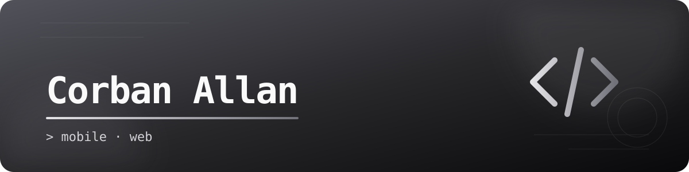

  

  
  
  

---

### `$ whoami`

Welcome to my corner of GitHub. This is where I share the projects I am building, the ideas I am exploring, and what I learn along the way.

### `$ ls ./tech-stack`

  
  
  
  
  
  
  
  
  

### `$ git stats`

<table>
  <tr>
    <td width="50%">
      
    </td>
    <td width="50%">
      
    </td>
  </tr>
</table>

### `$ git log --graph`

  

### `$ find ./projects`

Take a look through [my repositories](https://github.com/CorbanAllan?tab=repositories) to see what I have been working on.

  <code>corban@github:~$</code> Thanks for stopping by — feel free to explore, star, or say hello.

